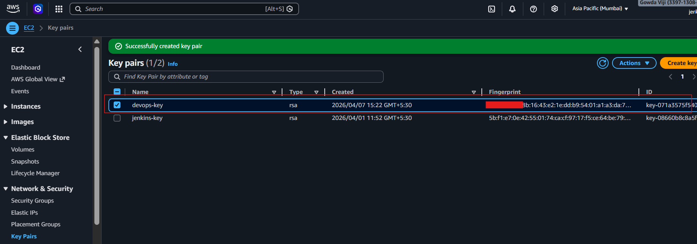
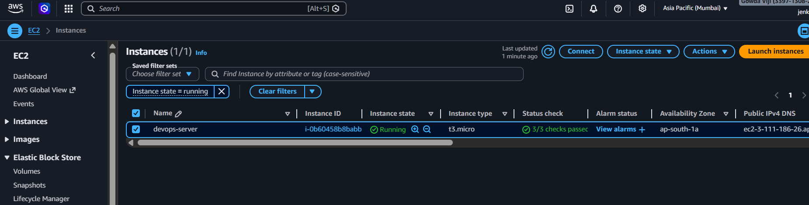
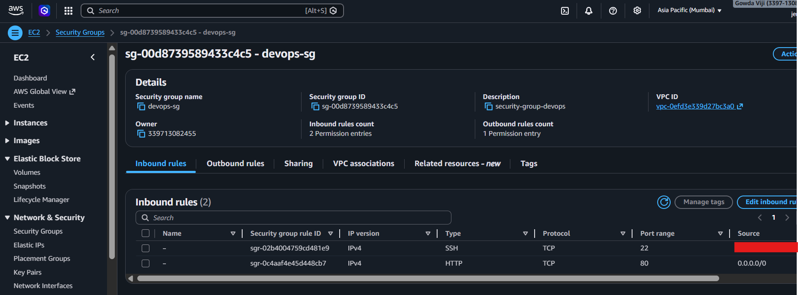
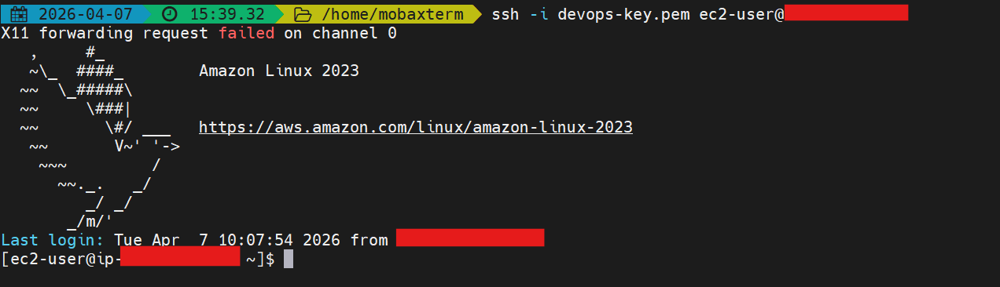
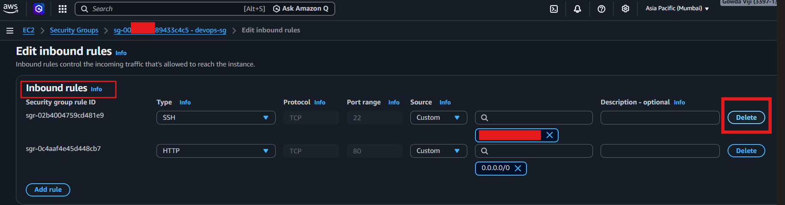
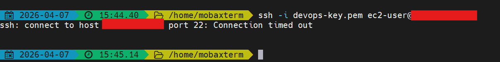
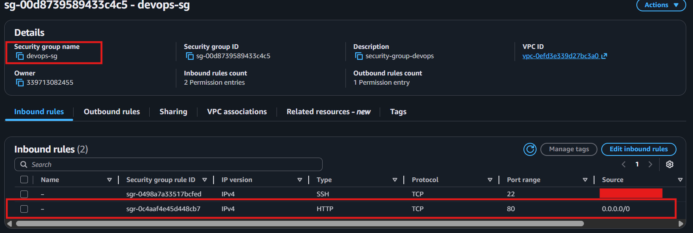
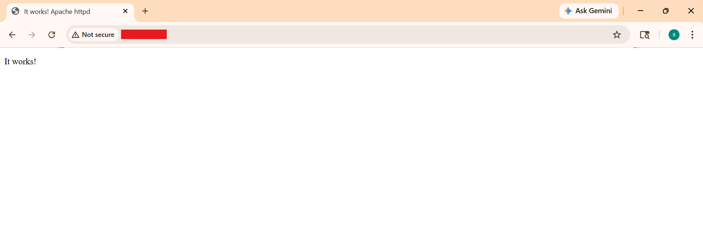
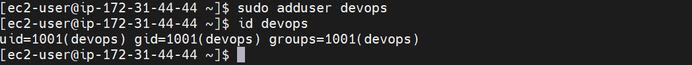

# AWS EC2 Security Setup

---

## Objective

Secure an AWS EC2 instance using:

* Key Pair authentication
* Security Groups (firewall rules)
* SSH access control
* Basic system hardening

---

## Step 1: Key Pair Creation

### Steps:

* Go to **EC2 → Key Pairs**
* Click **Create Key Pair**
* Name: `devops-key`
* Type: RSA
* Download `.pem` file

### Command (set permission):

```bash
chmod 400 devops-key.pem
```



---

## Step 2: Launch EC2 Instance

### Steps:

* Go to **EC2 → Instances → Launch Instance**
* Name: `devops-server`
* AMI: Amazon Linux
* Instance type: `t2.micro`
* Select key pair: `devops-key`

### Security Group Rules:

| Type | Port | Source    |
| ---- | ---- | --------- |
| SSH  | 22   | My IP     |
| HTTP | 80   | 0.0.0.0/0 |



---

## Step 3: Security Group Configuration

### Steps:

* Go to **Security Groups**
* Edit inbound rules

### Rules:

* SSH (22) → My IP
* HTTP (80) → Anywhere

Best Practice:

* Avoid SSH from `0.0.0.0/0`



---

##  Step 4: SSH Access

### Command:

```bash
ssh -i devops-key.pem ec2-user@<PUBLIC-IP>
```

### Expected Output:

```bash
ec2-user@ip-xxx:~$
```



---

## Step 5: Security Validation (Access Test)

### Remove SSH Rule

* Remove port 22 from Security Group



---

### Try SSH Again

```bash
ssh -i devops-key.pem ec2-user@<PUBLIC-IP>
```

Expected:

```bash
Connection timed out
```



---

### Restore SSH Access

* Add SSH rule back (My IP)



Then i able to SSH
---

## Step 6: Install Apache

### Commands:

```bash
sudo yum install httpd -y
sudo systemctl start httpd
sudo systemctl enable httpd
```

### Access in browser:

```
http://<PUBLIC-IP>
```



---

## Step 7: User Management

### Commands:

```bash
sudo adduser devops
sudo usermod -aG wheel devops
```

### Verify:

```bash
id devops
```



---

## Step 8: SSH Hardening

### Edit SSH Config:
It reduces attack surface and makes your server much harder to break

```bash
sudo vi /etc/ssh/sshd_config
```

### Update:

```
PasswordAuthentication no
```

### Restart SSH:

```bash
sudo systemctl restart sshd
```

---

## Outcome

* Secure EC2 access using key-based authentication
* Configured firewall rules using Security Groups
* Tested real-world access restriction scenario
* Improved instance security with SSH hardening
