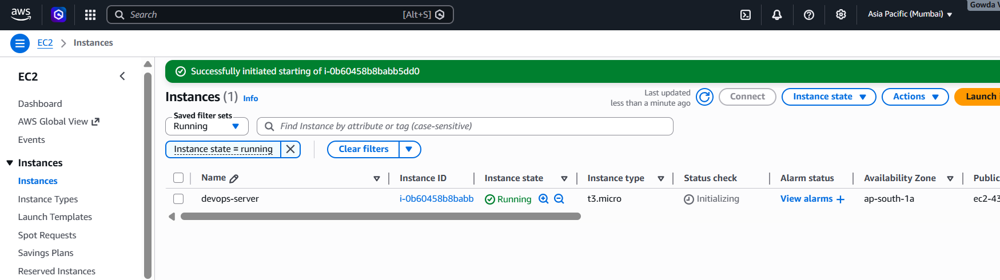
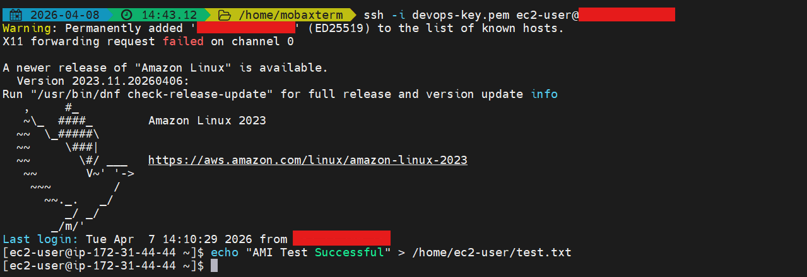
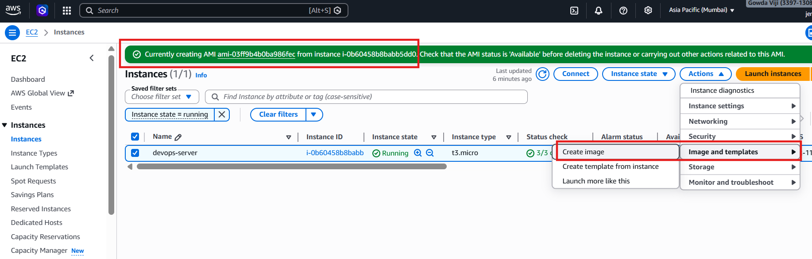
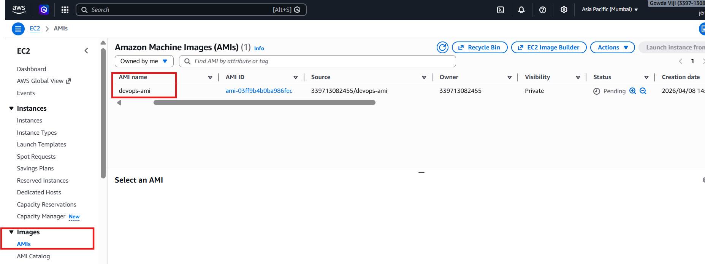
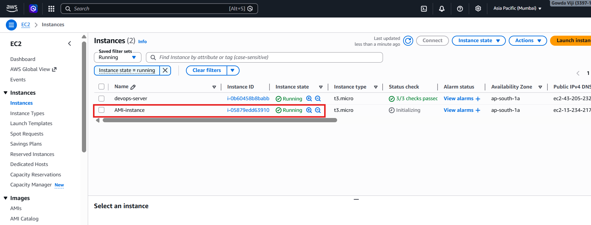
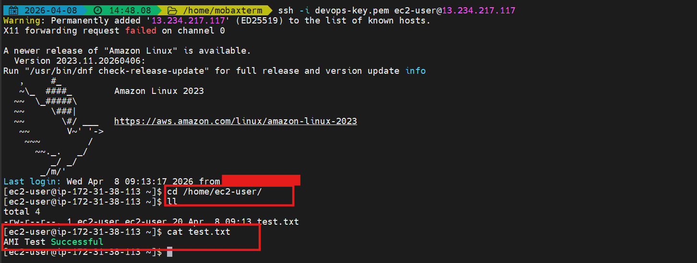

# EC2 Image (AMI) Management

---

## Objective

This project demonstrates how to:

* Create an AMI (Amazon Machine Image) from an EC2 instance
* Launch a new EC2 instance using the AMI
* Verify data and configuration cloning

This represents **real-world use cases** like backup, scaling, and environment replication.

---

## Services Used

* AWS EC2
* AMI (Amazon Machine Image)
* Security Groups
* SSH

---

## STEP 1 — Prepare EC2 Instance

Use an existing EC2 instance (Amazon Linux recommended).

Create a test file to verify cloning:

```bash
echo "AMI Test Successful" > /home/ec2-user/test.txt
```

EC2 instance running + Public IP


able to ssh and creating file


---

## STEP 2 — Create AMI

1. Go to **EC2 → Instances**
2. Select your instance
3. Click **Actions → Image and templates → Create Image**



---

## STEP 3 — Verify AMI

1. Go to **EC2 → AMIs**
2. Check dashboard → **visible**



---

## STEP 4 — Launch EC2 from AMI

1. Select AMI
2. Click **Launch Instance**
3. Configure:



---

## STEP 5 — Verify Cloned Data

Connect to the new instance:

```bash
ssh -i devops-key.pem ec2-user@<NEW-PUBLIC-IP>
```

Verify the test file:

```bash
cat /home/ec2-user/test.txt
```

Expected output:

```bash
AMI Test Successful
```

Data verification


---

## Outcome

* Created reusable machine image (AMI)
* Launched new EC2 instance from AMI
* Verified that data and configuration are cloned

---

## Key Concepts

* AMI acts as a **template** for launching EC2 instances
* Used for **backup, scaling, and disaster recovery**
* Ensures **consistent environments across deployments**
