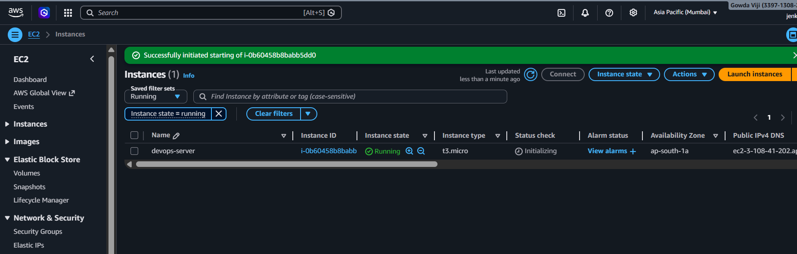
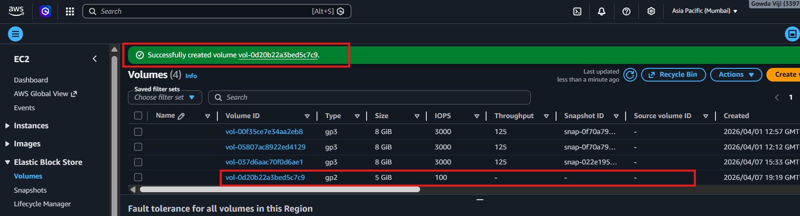
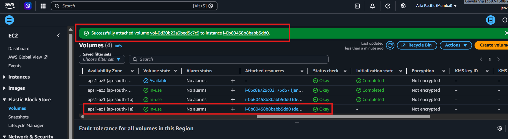
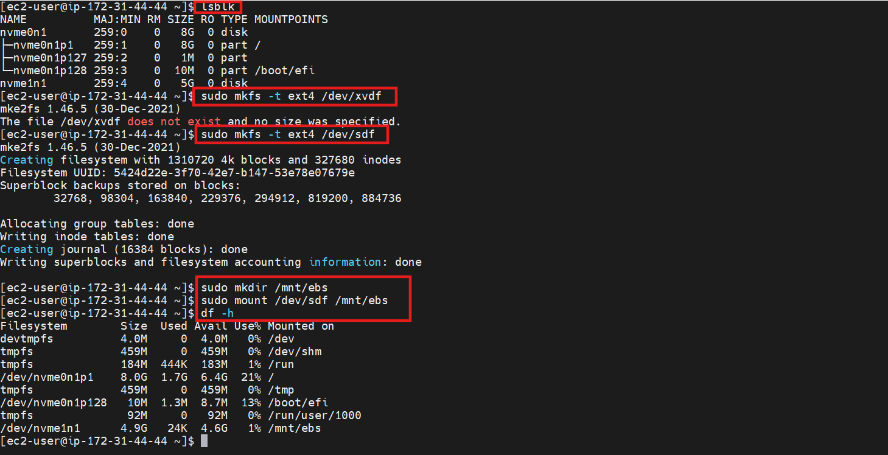
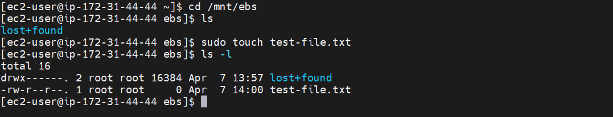
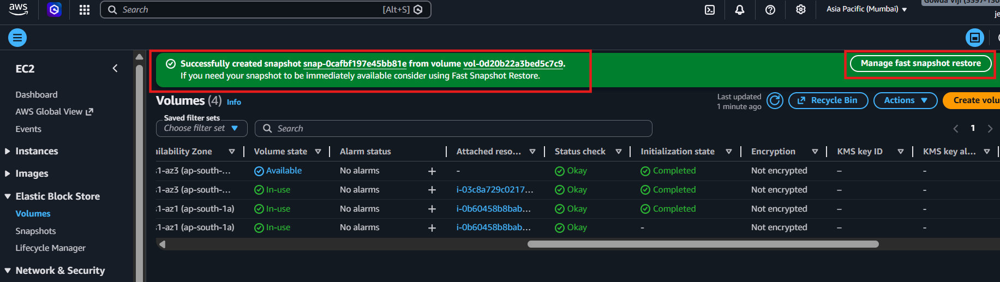
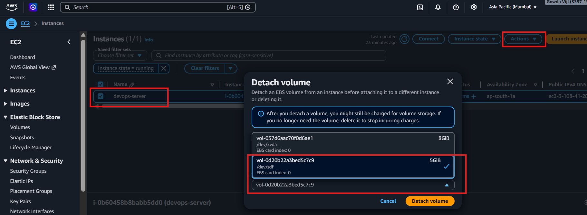
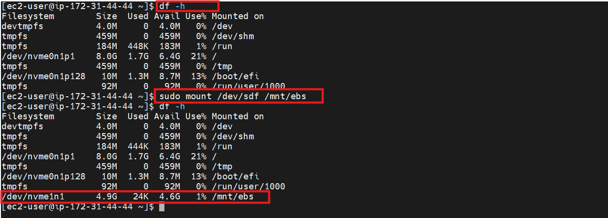

# 💾 EC2 Storage — EBS Management

---

## 📌 Objective

Hands-on lab for managing AWS EBS volumes:

- Create EBS volume
- Attach it to an EC2 instance
- Mount and verify volume
- Add test file
- Take snapshot
- Detach & reattach volume to verify persistence

This lab demonstrates **practical AWS storage skills**.

---

## 🔹 STEP 1 — Launch EC2 (If not already)

- Use **Amazon Linux / Ubuntu**
- Instance type: `t2.micro` (free tier)
- Security Group: SSH (22) → My IP

📸 Screenshot 1: EC2 instance running + Public IP  


---

## 🔹 STEP 2 — Create EBS Volume

1. Go to **EC2 → Volumes → Create Volume**
2. Fill details:  
   - Volume Type: `gp2`  
   - Size: `5 GB` (for lab)  
   - Availability Zone: same as your EC2 instance
3. Click **Create Volume**


---

## 🔹 STEP 3 — Attach Volume to EC2

1. Select your volume → **Actions → Attach Volume**  
2. Choose your EC2 instance  
3. Device: `/dev/sdf` (Linux)  

📸 Screenshot 3: Volume attached  


---

## 🔹 STEP 4 — Connect via SSH

```bash
ssh -i devops-key.pem ec2-user@<PUBLIC-IP>
```

## 🔹 STEP 5 — Mount Volume
```
# List devices
lsblk

# Create filesystem (first time only)
sudo mkfs -t ext4 /dev/xvdf

# Create mount point
sudo mkdir /mnt/ebs

# Mount volume
sudo mount /dev/xvdf /mnt/ebs

# Verify
df -h
```



## 🔹 STEP 6 — Add Test File

```
cd /mnt/ebs
sudo touch test-file.txt
ls -l
```


## 🔹 STEP 7 — Take Snapshot

Go to EC2 → Volumes → Select Volume → Actions → Create Snapshot



## 🔹 STEP 8 — Detach & Reattach Volume

```bash
Instance → Actions → Detach Volume
Reattach to same or new EC2 → /dev/sdf
Mount again:
```


**Reattach Volume**
```
sudo mount /dev/xvdf /mnt/ebs
ls -l /mnt/ebs
```



