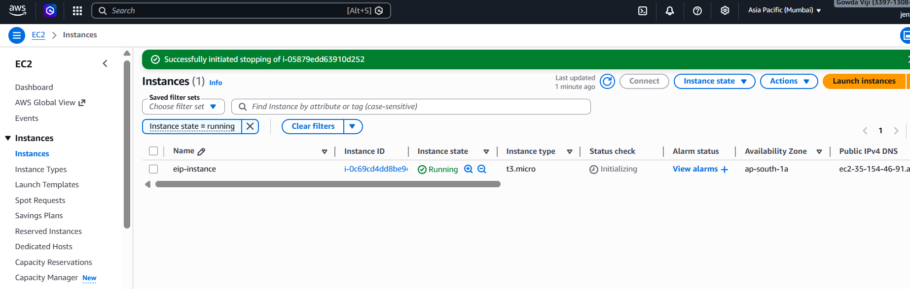
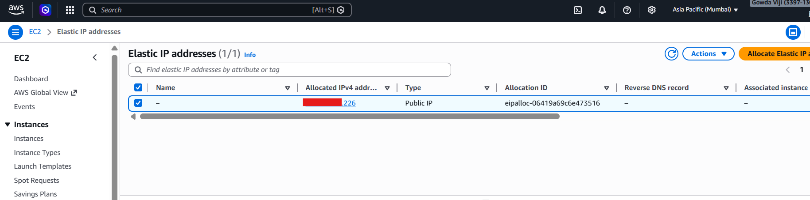
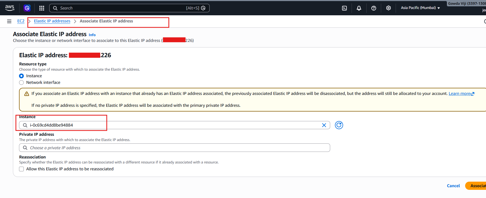
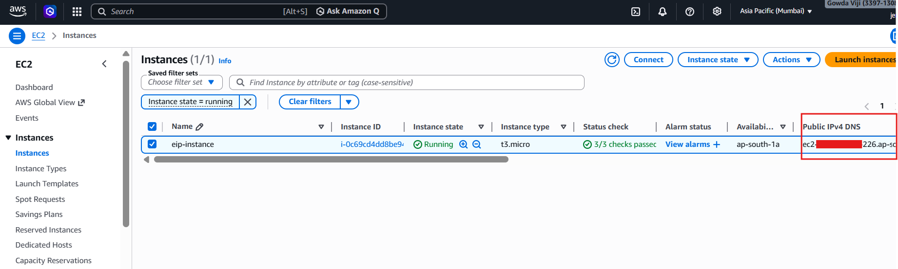
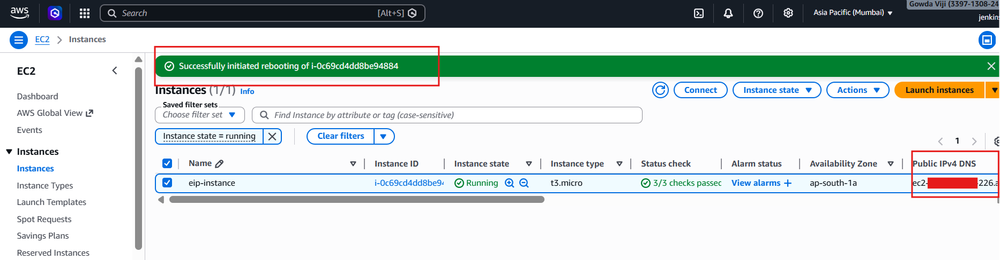

# Elastic IP — Static Addressing

---

## Objective

This project demonstrates how to:

* Allocate an Elastic IP (EIP)
* Associate it with an EC2 instance
* Replace dynamic public IP with a static IP
* Verify that the IP remains unchanged after instance restart

---

## Services Used

* AWS EC2
* Elastic IP
* Security Groups

---

## STEP 1 — Launch EC2 Instance

* Launch EC2 instance (Amazon Linux / Ubuntu)
* Instance type: `t2.micro`
* Security Group: SSH (22) → My IP

---

## STEP 2 — Note Initial Public IP

* Go to EC2 instance
* Copy the **Public IP**

This IP will change after restart (without Elastic IP)

---

## STEP 3 — Allocate Elastic IP

1. Go to **EC2 → Elastic IPs**
2. Click **Allocate Elastic IP**
3. Click **Allocate**

---

## STEP 4 — Associate Elastic IP

1. Select the allocated Elastic IP
2. Click **Actions → Associate Elastic IP**
3. Choose your EC2 instance
4. Click **Associate**

---

## STEP 5 — Verify Public IP Change

* Go to EC2 instance
* Check **Public IP**

It should now be replaced with the Elastic IP

---

## STEP 6 — After Reboot Instance or

Elastic IP remains same

---

## Concepts

* Elastic IP = **Static Public IP**
* Used to maintain a **fixed public IP address**
* Default EC2 public IP is dynamic and changes after restart
* Elastic IP remains constant across stop/start cycles

---

## Outcome

* Successfully allocated and associated Elastic IP
* Replaced dynamic IP with static IP
* Verified IP persistence after instance restart
* Understood real-world usage of static addressing
