# CI/CD Pipeline using AWS, Jenkins & Docker for Auto Deployment

---

## Overview

This project demonstrates a complete CI/CD pipeline using AWS, Jenkins, and Docker to automatically deploy a static website inside a Docker container on a separate EC2 instance.

---

## Technologies Used

* AWS (IAM, EC2, Security Groups)
* Jenkins
* Docker
* GitHub

---

# STEP 1: Create IAM User

* IAM → Users → Create User
* Name: `jenkins-user`
* Attach policy: `AdministratorAccess`

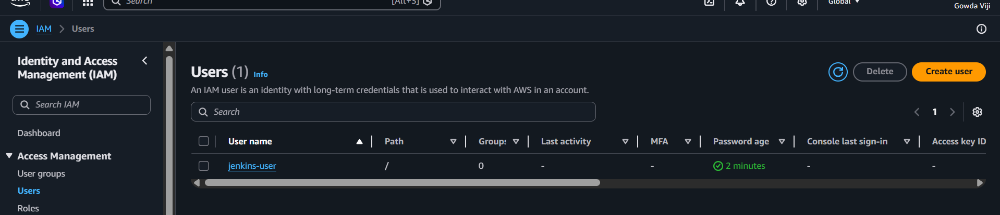

---

# STEP 2: Create Key Pair

* EC2 → Key Pairs → Create
* Name: `jenkins-key`

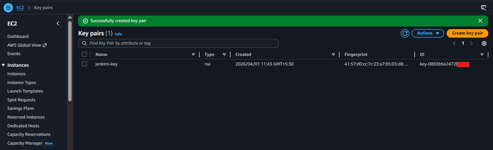

---

# STEP 3: Create Security Group

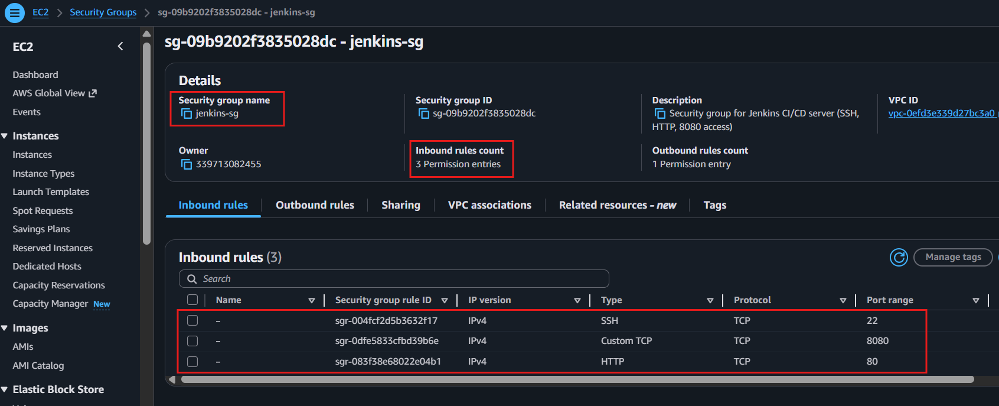

---

# STEP 4: Launch EC2 Instances

Created **2 EC2 instances**:

1️ Jenkins Server
2️ Docker Server

* AMI: Amazon Linux
* Instance type: t2.micro
* Same key pair and security group

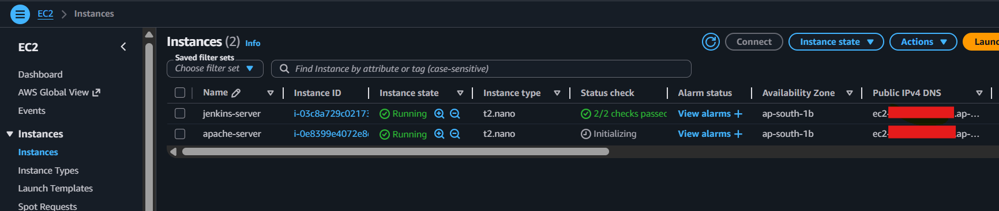

---

# STEP 5: Connect to Servers

```bash
ssh -i jenkins-key.pem ec2-user@<jenkins-public-ip>
ssh -i jenkins-key.pem ec2-user@<docker-public-ip>
```
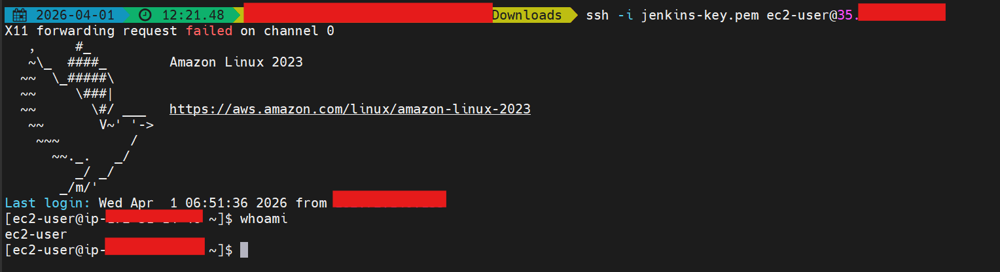

---

# STEP 6: Install Jenkins (on Jenkins Server)

```bash
sudo yum install java-11-openjdk -y

sudo wget -O /etc/yum.repos.d/jenkins.repo \
https://pkg.jenkins.io/redhat-stable/jenkins.repo

sudo rpm --import https://pkg.jenkins.io/redhat-stable/jenkins.io.key

sudo yum install jenkins -y

sudo systemctl start jenkins
sudo systemctl enable jenkins
```

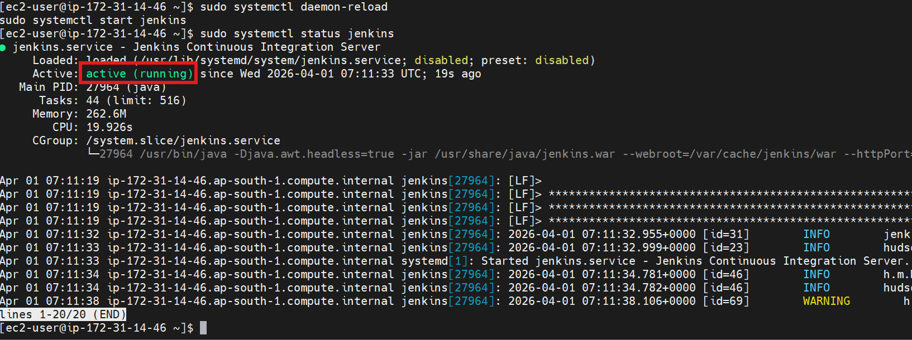

```
Access Jenkins UI:
```
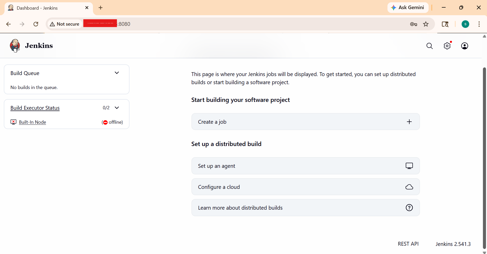


# Unlock Jenkins

```bash
sudo cat /var/lib/jenkins/secrets/initialAdminPassword
```

* Enter password in browser
* Install suggested plugins

---

# STEP 8: Setup SSH (Jenkins → Docker Server)

Copy keyfile from local to ec2 on Jenkins server using terminal

```bash
scp -i jenkins-key.pem jenkins-key.pem ec2-user@jenkins-public-ip:~
```

SSH Test connection to Docker server from jenkins server:

```bash
ssh -i ~/jenkins-key.pem ec2-user@docker-private-ip
```
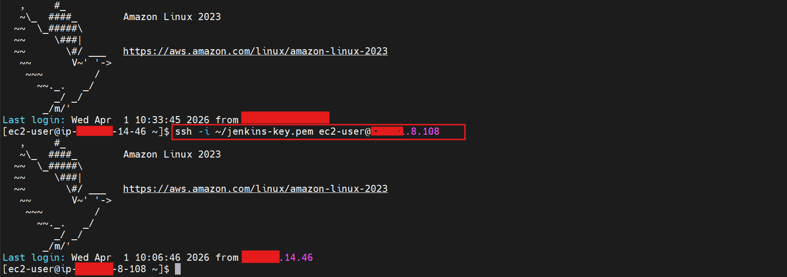

---

# STEP 9: Install Docker (Docker Server)

```bash
sudo yum install -y docker
sudo systemctl start docker
sudo systemctl enable docker
```

Verify:

```bash
docker --version
```

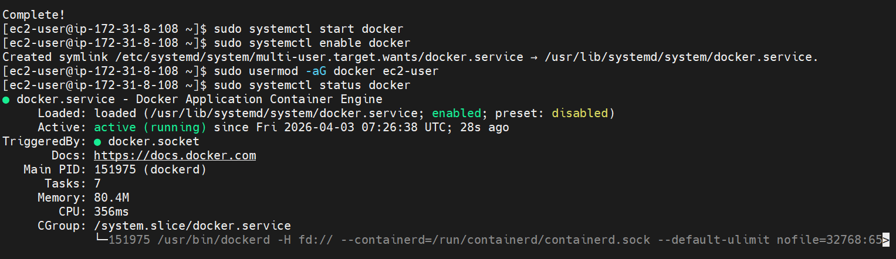

---

# STEP 10: Create GitHub Repository

Files:

* `index.html`
* `Dockerfile`
* `Jenkinsfile`

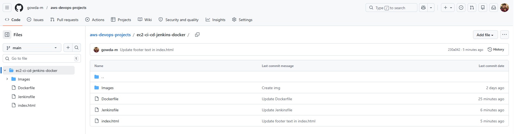

---

# STEP 11: Create Jenkins Pipeline

* Jenkins → New Item → Pipeline
* Add GitHub repository URL with public
* Configure to use Jenkinsfile

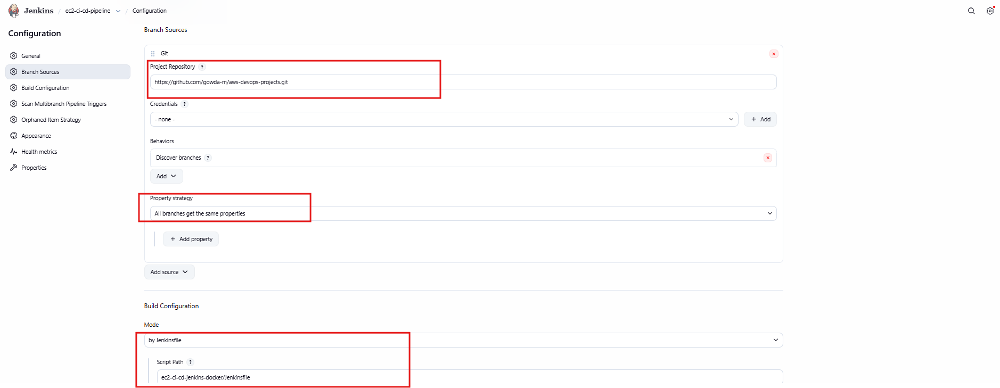

Add Credentials and Configure Node (Agent)
- After saving, Jenkins will connect via SSH
- Node status should show **Online**

 
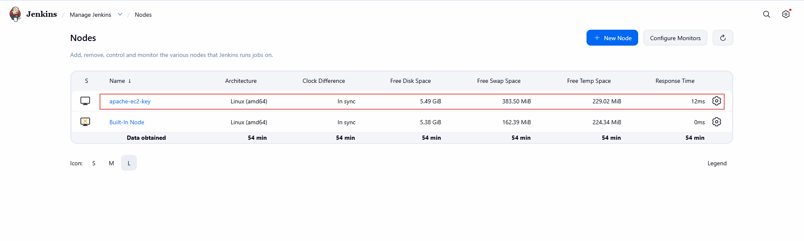


---

# STEP 12: Manully Docker Build & Run

* Jenkins builds Docker image
* Runs container on Docker server

Verify:

```bash
docker ps
```
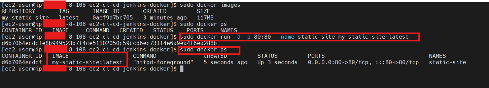

---

# STEP 13: Verify Website

Open in browser:

```
http://<docker-public-ip>
```

---

# STEP 14: Setup Auto Build Trigger (GitHub Webhook)

Configure webhook in GitHub:

```
http://<jenkins-public-ip>:8080/github-webhook/
```
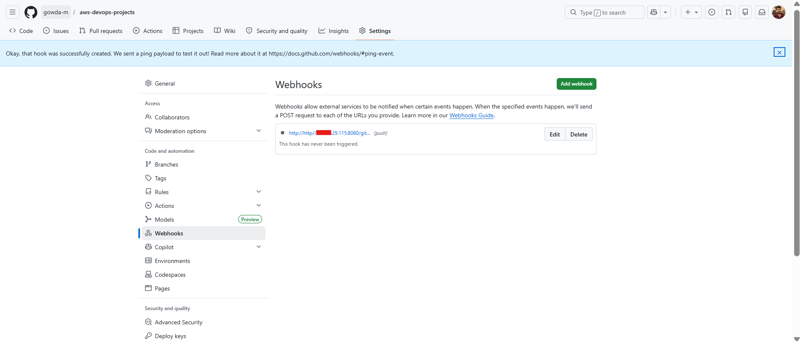

---

# STEP 15: Auto Deployment Test ( Docker Build & Run via Jenkins)

* Modify `index.html`
* Push changes to GitHub
* Jenkins automatically triggers build
* Docker container gets updated

Jenkins automatically triggers build
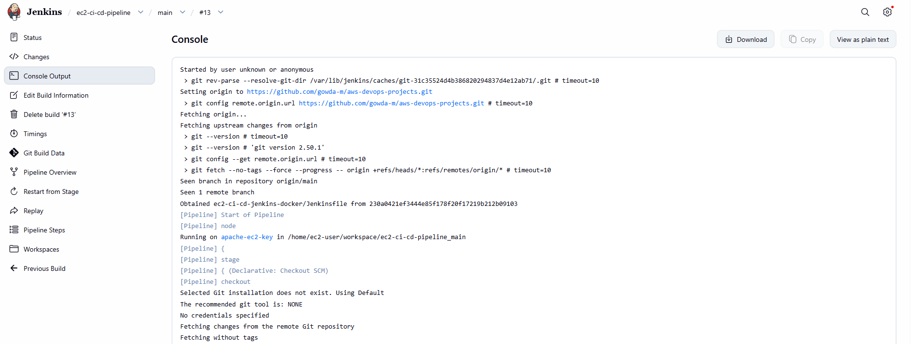

build success
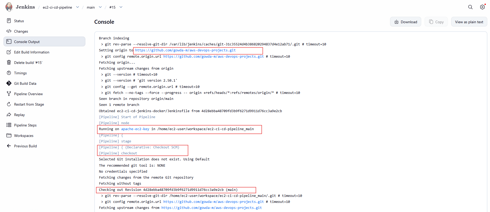
---
# STEP 16: Verify Website After Code Push

- Commit and push changes to GitHub (main branch)

```bash
git add .
git commit -m "updated website content"
git push origin main
```
```
http://<docker-public-ip>
```

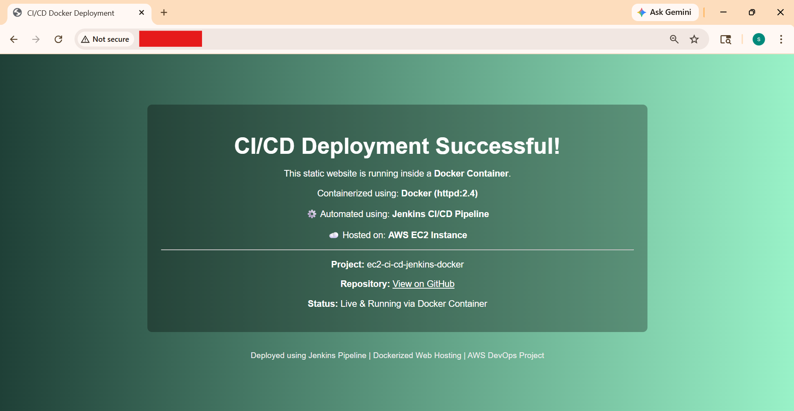

---

## CI/CD Workflow

```text
GitHub → Jenkins Server → Docker Server → Container → Browser
```

---

## Final Result

* Jenkins runs on separate EC2 instance
* Docker runs on separate EC2 instance
* Fully automated CI/CD pipeline
* Auto deployment on code changes
* Website served via Docker container
